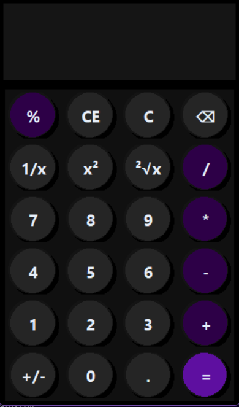

# Basic Calculator GUI

A simple calculator application with a graphical user interface.  
This project was built for learning purposes and serves as a reference for basic GUI development and arithmetic logic.

## Features
- Addition
- Subtraction
- Multiplication
- Division
- Clear / Reset functionality
- Simple and user-friendly interface
- Round icons with drop shadow and depth effect

## Tech Stack
- Programming Language: Python
- GUI Framework: Tkinter

## Screenshot




## Getting Started

### Prerequisites
- Python 3.12.7 or higher
- Tkinter and Math libraries

### Run the Application
1. Clone the repository:
   ```bash
   git clone https://github.com/your-username/basic-calculator-gui.git

## Purpose
This project was created to practice GUI development and basic programming concepts.  
It serves as a reference for future learning.

## License
This project is open for learning and personal use.

